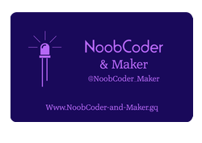

  

  
  

# NoobCoder &amp; Maker's experiments with the CamJam EduKit

  Hi there, thanks for stopping by.
My name is George and I have developed this website to showcase my electronic projects, along with the coding sources that I have used, or created, to run them. Initially I will be working with both the Raspberry Pi 3 and the Pi zero boards using the 'Python' programming language making use of the components from the 'CamJam' series of kits. Later, progressing on to using 'Python 3', to create my own scripts, to run my creations. At some stage I will also be working with the 'Arduino' platform using the Arduino Uno, Arduino Nano, Adafruit Trinket and the Adafruit Pro Trinket. Initially this will be making use of the literature that accompanies the 'Arduino Starter Kit', which will give me a sound footing to develop my oxn projects. Finally, I would like to build some of the fantastic projects available on the 'Hackster' and the 'Instructables' platforms, which are all open-source projects.

Here is a link to my new website.
## [NoobCoder-And-Maker.gq Website!](http://noobcoder-and-maker.gq)

Here you'll find my Twitter feed.
## [@NoobCoder_Maker](https://twitter.com/NoobCoder_Maker)

What about my blog over at.
## [NoobCoder-And-Maker-Blog.gq!](http://noobcoder-and-maker-blog.gq)

Here's a link to my new CamJam website.
## [NoobCoder-Camjam-Adventures.gq Website!](http://noobcoder-camjam-adventures.gq)
